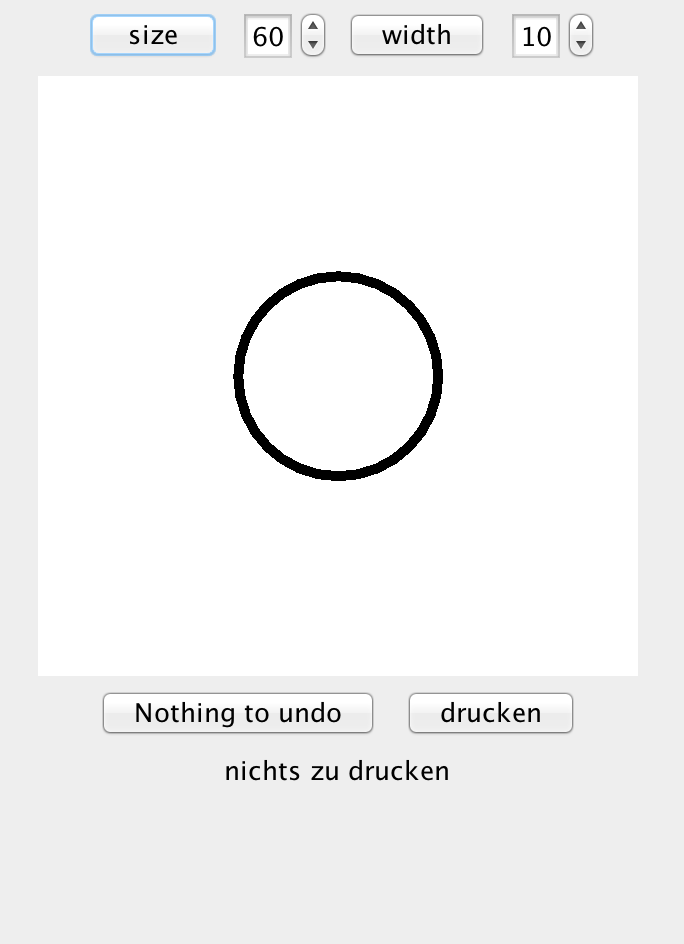

# KreisMaler

Test

## Teil I: Implementation

Pflichtaufgaben:
1. Undo: Aktionen sollen rückgängig gemacht werden können
2. Standard-Operationen der Queue
3. Hinzufügen und Löschen von Druckaufträgen

*Wahlaufgaben (mindestens eine):*
* Redo: Rückgängig gemachte Funktionen sollen erneut durchgeführt werden können
* Unit Test für die Queue
* Weitere Aktionen (z.B. WidthAction)
* Eine alternative grafische Form (z.B. Rechteck)
* Alternative View mit anderer Anordnung der Elemente

Achtet darauf, euren Code zu kommentieren, d.h. jede Klasse und Methode muss durch JavaDoc-Kommentare kurz beschrieben werden (inkl. Parameter und Rückgabewert). Besondere Stellen in einzelnen Methoden sollten zusätzlich erläutert werden.

## Teil II: Dokumentation
Erstellt ein Objektdiagramm, dass Beispielhaft die Vorgänge von Undo und Drucken dokumentiert. Nutzt dafür http://draw.io 

## Abgabe
