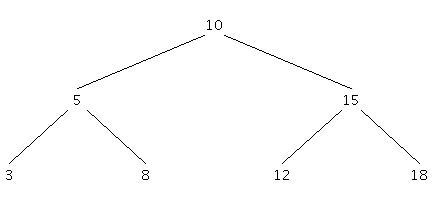

#### Informatik GK Q1: Rekursive Datenstrukturen - Binärbäume

# Suchbäume

Binäre Bäume können auch genutzt werden, um Daten geordnet zu speichern. Dabei ist ein Element um so kleiner, je weiter links es steht. Solche Bäume werden häufig Suchbäume genannt, da sie im Vergleich zur Suche in Listen eine effektive Suche eines Elements ermöglichen. Denn wenn ein Element gesucht wird, genügt ein Vergleich mit der Wurzel, um zu entscheiden, ob der linke oder der rechte Teilbaum weiter durchsucht werden muss, wenn die Wurzel nicht schon das gesuchte Element enthält. Es muss maximal einer der Teilbäume geprüft werden. Den anderen Teilbaum braucht man nicht mehr zu berücksichtigen.

Zum Beispiel könnten Kunden nach ihrer Kundennummer geordnet in einem binären Suchbaum gespeichert werden.



## Aufgaben

1. Erstellen Sie die Suchbäume, die entstehen, wenn die folgenden Daten in der angegebenen Reihenfolge eingefügt werden:
a) 23, 5, 12, 42, 73, 38, 2, 1, 3
b) 1, 2, 3, 4, 5

2. Welche Traversierung eines Suchbaumes ergibt eine sortierte Liste?

3. Starten Sie das Programm IntegerSuchbaum. Geben Sie die Zahlenfolgen aus der Aufgabe 1a) ein und überprüfen Sie Ihr Ergebnis. Löschen Sie nun nacheinander die Zahlen 1, 2, 5 und 23. Betrachten Sie die jeweils enstandenen Bäume. Beschreiben Sie die Veränderung eines Suchbaumes durch eine Lösch-Operation möglichst allgemein!

#### Entscheiden Sie sich für eine Aufgabenvariante:

a) Erstellen Sie ein gezeichnetes Erklärvideo, in dem Sie den Aufbau und die Verwendung eines Suchbaums sowie die Operationen Einfügen und Löschen erklären!

b) Impementieren Sie einen Häufigkeitsbaum anhand der folgenden Teilaufgaben.

Suchbäume  können genutzt werden, um die Häufigkeiten von Zeichen in Texten zu ermitteln. Zum Beispiel ist es sinnvoll für Kodierungen und Komprimierungsverfahren zu wissen, welche Zeichen häufig verwendet werden. Wenn die Kodierung der Übermittlung und nicht um Geheimhaltung dient, sollten Buchstaben, die häufig vorkommen einen einfachen Code erhalten.

1. Betrachten Sie die Dokumentation der NRW Klasse ```BinarySearchTree``` und des Interface ```ComparableContent``. Machen Sie sich klar, wofür das Interface benötigt wird!

2. Implementieren Sie für die Anwendung Haeufigkeitsbaeume die Methode ```itemMitHaeufigkeitEinfuegen()```.

3. Lassen Sie sich über dem Menüpunkt "InOrder Traversierung ausgeben" eine nach dem Alphabet sortierte Liste der Buchstaben anzeigen. Implementieren Sie dazu ```traverseInorderToList```.

4. Vervollständigen Sie nun die Methode ```erstelleSortierteListe()```, welche die Buchstaben sortiert nach ihrer Häufigkeit ausgeben soll. Durchlaufen Sie dazu den Baum und fügen Sie alle Elemente in einen neuen, nach der Häufigkeit sortierten Baum ein. Verwenden Sie dazu die Klasse ```CountedContent```, welche Sie noch bearbeiten müssen.

5. Der maximale Aufwand für das Suchen, ist proportional zur Baumhöhe. Ein extrem ungünstiger Baum ist zu einer Liste degeneriert. Ein balancierter Baum hat eine möglichst geringe Höhe. Gegenüber einer Liste ist der durchschnittliche Aufwand zum Finden eines Elements dann nicht mehr O(n) (linear) sondern O(log n) logarithmisch. Erstellen Sie einen Suchbaum für die Zahlen von 1-15, mit der eine Zahl möglichst schnell gefunden wird.

6. Implementieren Sie die Methode ```gibHoehe()```
